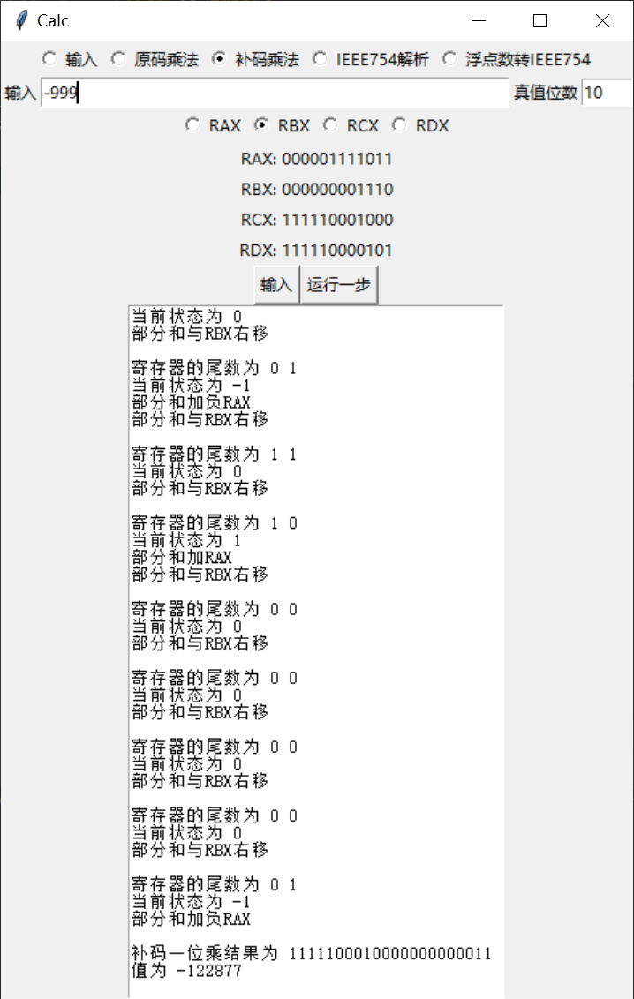
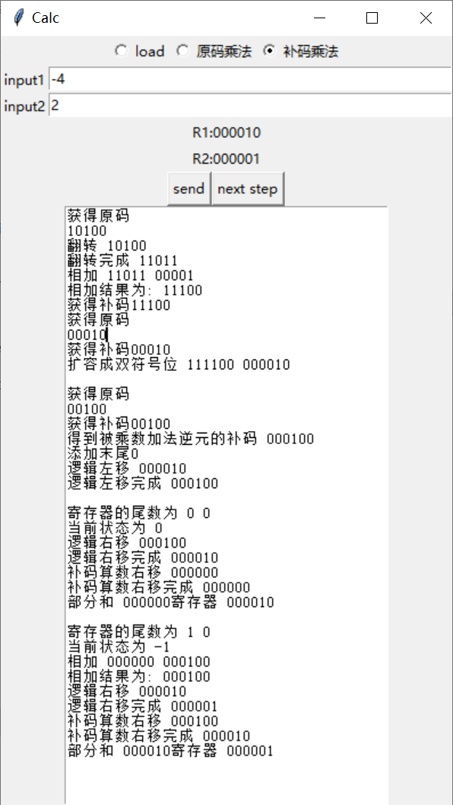

## upgraded-spork

目前最多支持4位的运算（我觉着位数太多反而没啥意义了

可以进行原码一位乘法

与补码一位乘法(booth 算法)

支持输出每个步骤

或许可以用来帮助复习？（不过这个东西本来就是我不想复习了的产物？

## 食用方法

```
python main.py
```

输入完之后点一下send把数存起来

之后就可以连击next step按钮开始单步运行了

## 更新

2021.1.6 加入单步运行！ python yyds

2021.1.11 代码重构，支持对于不同的寄存器的读写，以及预设计寄存器位数

## 运行截图

版本3



版本2



